# Wanis — An Elderly-Care Companion Robot

A mobile robot that follows a specific elderly person around their home, keeps following the *right* person in a crowd, detects if they fall, Measures their biometrics, and brings them their medication on schedule.

Graduation project. Two full hardware prototypes, ROS 2 Jazzy on Ubuntu 24.04, built on hacked hoverboard motors.

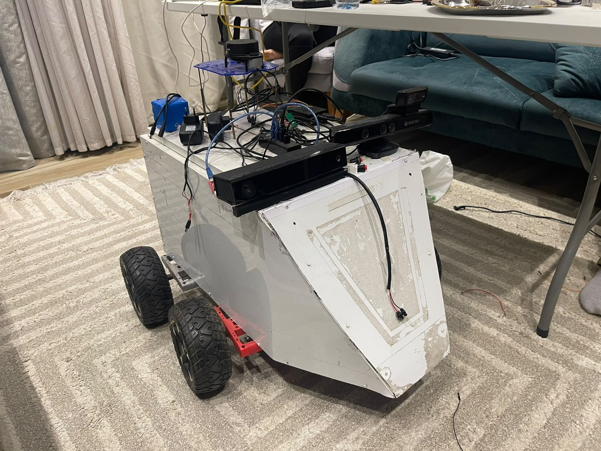

---

## What it does

- **Follows one specific person.** Not "a person" — *the* person. Locks onto a target and re-identifies them by appearance after they leave view, walk behind furniture, or stand next to someone else.
- **Recovers when it loses them.** A four-stage recovery ladder: back up → scan in place → drive to frontier waypoints → re-acquire by appearance match.
- **Detects falls** with a custom-trained YOLO model and raises an alert.
- **Delivers medication** on a schedule via an ESP32 pill dispenser, interrupting whatever it was doing.
- **Measures biometrics.** An ESP32 with MAX30102/MAX30205 sensors reports heart rate, blood-oxygen saturation and body temperature over Wi-Fi, so a fall alert arrives with context rather than on its own.
- **Refuses to hit anything.** A safety node sits between every other node and the motors, and has final say.

## Demo

<!-- To make these play inline: open this README on GitHub, drag the matching
     file from media/video/ into a comment box, and replace the link below with
     the https://github.com/user-attachments/assets/... URL it produces. -->

| Clip | |
|---|---|
| [Final robot following a person](media/video/01-final-robot-following.mp4) | The finished platform tracking and following its locked target |
| [Final build and testing](media/video/02-final-build-and-test.mp4) | Assembly of the final chassis and first drive |
| [Hacking the hoverboard motors](media/video/03-hoverboard-motor-hack.mp4) | Reflashing the mainboard and driving the wheels over serial |
| [Prototype 1 — real-life tests](media/video/04-prototype1-tests.mp4) | First prototype following in a home environment |
| [Prototype 1 — first run](media/video/05-prototype1-first-run.mp4) | Earliest working follow |
| [Prototype 1 — following](media/video/06-prototype1-following.mp4) | PID following with standoff distance |

---

## Design

The chassis was modelled in CAD before anything was cut, then built to match.

| Proposed model | Final proposed design |
|---|---|
| 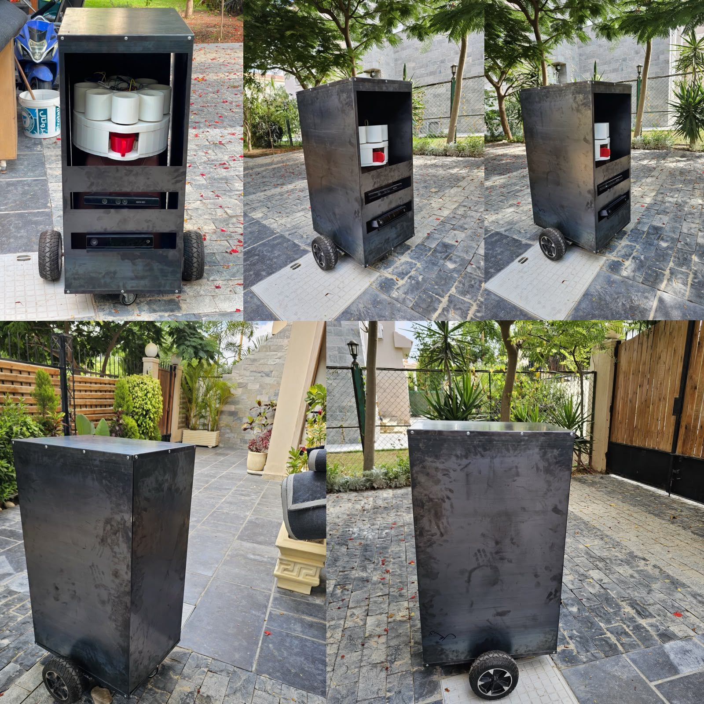 | 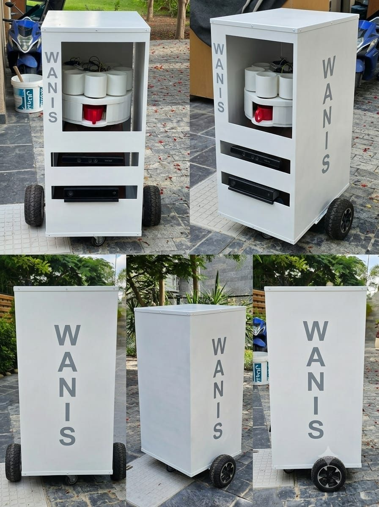 |

| Built | Internals |
|---|---|
|  | 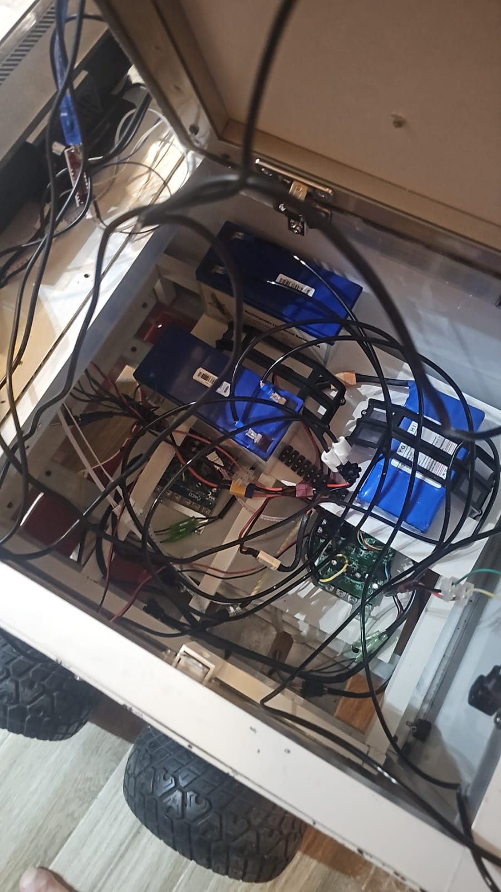 |

<details>
<summary><b>Build photos</b></summary>

| | |
|---|---|
| 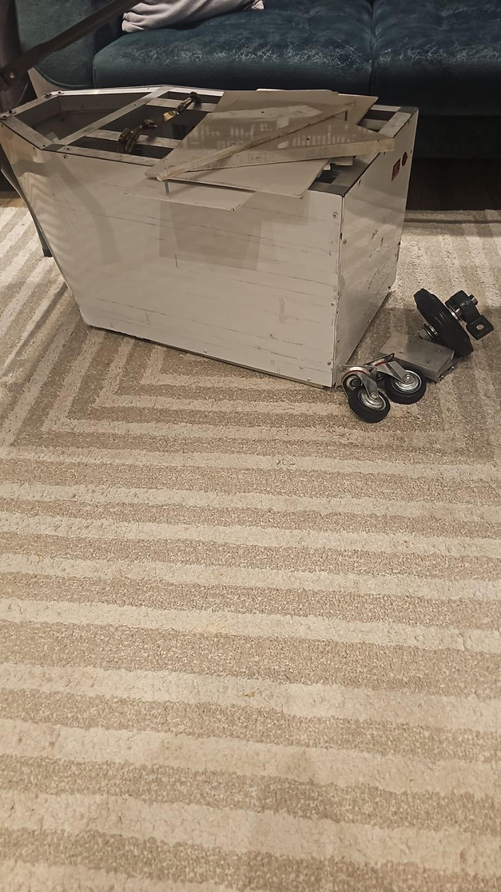 | 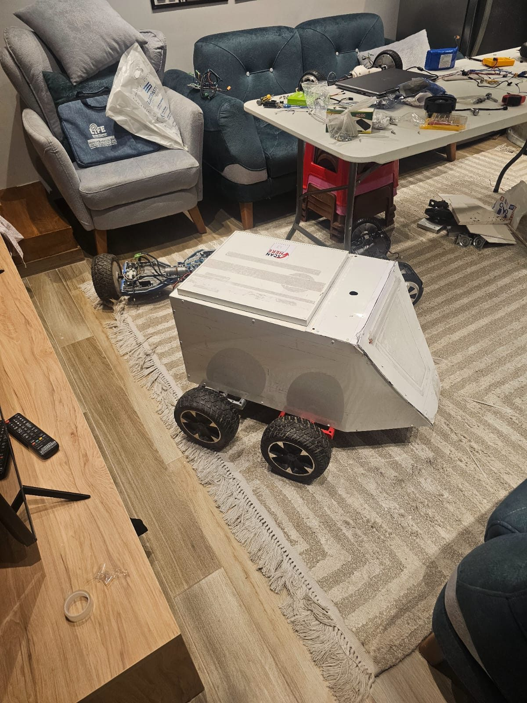 |
| Frame before assembly | Mounting the drive |
| 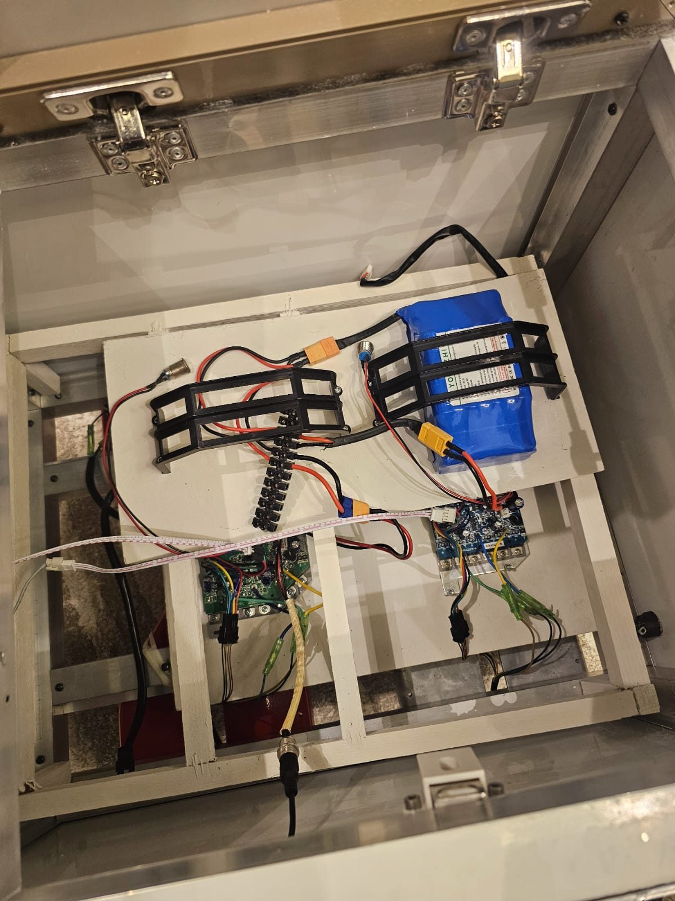 | 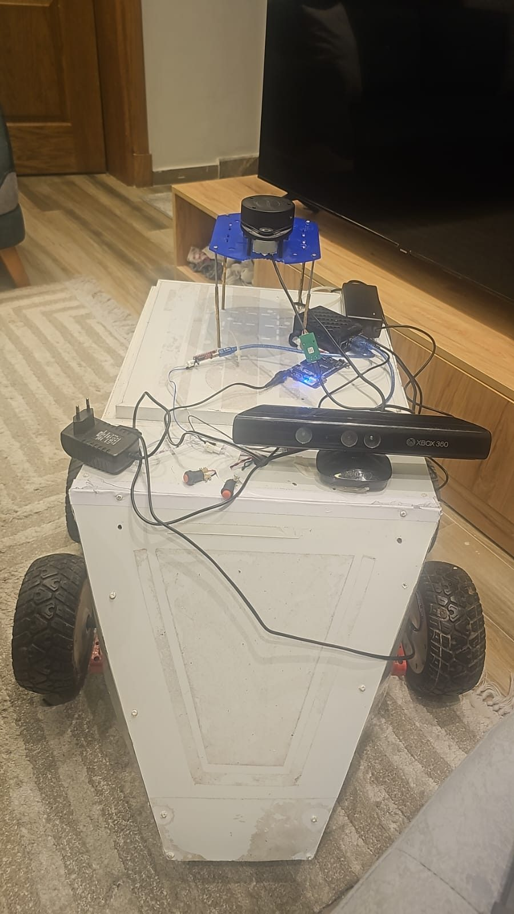 |
| Electronics layer | Mounting sensors |

</details>


---

## System architecture

Compute is split across two machines: a Raspberry Pi on the robot handles sensors, motor control and the safety layer; a laptop over Wi-Fi runs perception, navigation and the assistant.

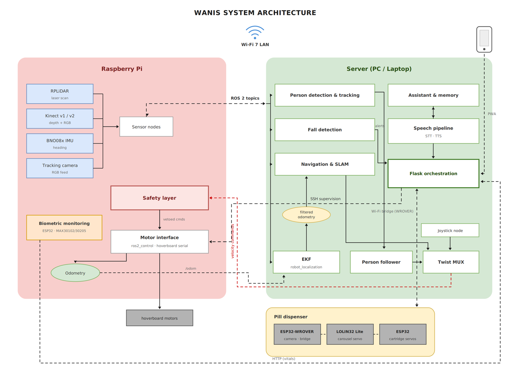

The split exists because the perception stack (YOLO segmentation + OSNet ReID, per frame) will not run in real time on a Pi, but the safety layer *must* keep running even if the network drops. So anything that can stop the wheels lives on the robot.

> **What this repository covers.** Wanis was a team project and the diagram shows the whole system. This repo contains the robotics and perception stack — drive, sensing, safety, navigation, person following — plus the fall-detection node. The assistant and memory, speech pipeline, Flask orchestration, pill-dispenser firmware and biometric monitoring were built by other team members and their code is not included here.

**Hardware**

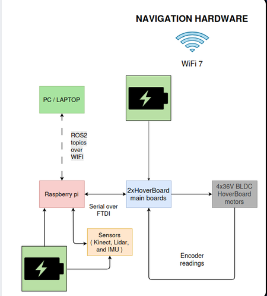

| Part | Role |
|---|---|
| Hoverboard wheels + FOC firmware | Drive. High torque, carries weight, low power draw |
| Raspberry Pi | Sensor nodes, `ros2_control`, safety layer |
| Laptop/PC | Perception, SLAM, Nav2, assistant |
| RPLiDAR | Obstacle detection, SLAM |
| Kinect v1 / v2 | RGB + depth for person tracking |
| BNO08x IMU | Heading |
| ESP32 ×3 | Pill dispenser (carousel + cartridges + camera bridge) |
| ESP32 + MAX30102 / MAX30205 | Vital signs — heart rate, SpO2, body temperature |

**Why hoverboard motors?** They give high torque, lift real weight, and draw little power — exactly what a home robot that must carry things needs, and they cost almost nothing second-hand. The wheels ship with locked firmware, so the motor controller was reflashed with [an open FOC firmware](https://github.com/hoverboard-robotics/hoverboard-firmware-hack-FOC) and driven over serial from `ros2_control`.

---

## The person-following node

The core of the project is [`final_person_follower.py`](src/person_follower/person_follower/final_person_follower.py) — a ~2,700-line ROS 2 node.

The hard problem is not detecting a person. It's staying locked onto **one** person when detection is noisy, people occlude each other, and the target walks out of frame entirely.

**Identity, not just detection.** Every tracked person gets a signature built from four independent cues:

| Cue | What it survives |
|---|---|
| OSNet ReID embedding (512-d) | Pose and viewpoint changes |
| HSV histograms, upper + lower body separately | Partial occlusion |
| LBP texture signature | Lighting changes |
| Depth from the Kinect, median over the mask | Scale ambiguity |

Scored together, the signature holds a lock through occlusion and re-acquires the target after they've been gone for a while. Splitting the histogram into upper and lower body matters more than it sounds — it's what stops the robot switching to someone wearing a similar shirt.

**Recovery state machine.** When the target is lost, giving up is not an option, so the node escalates:

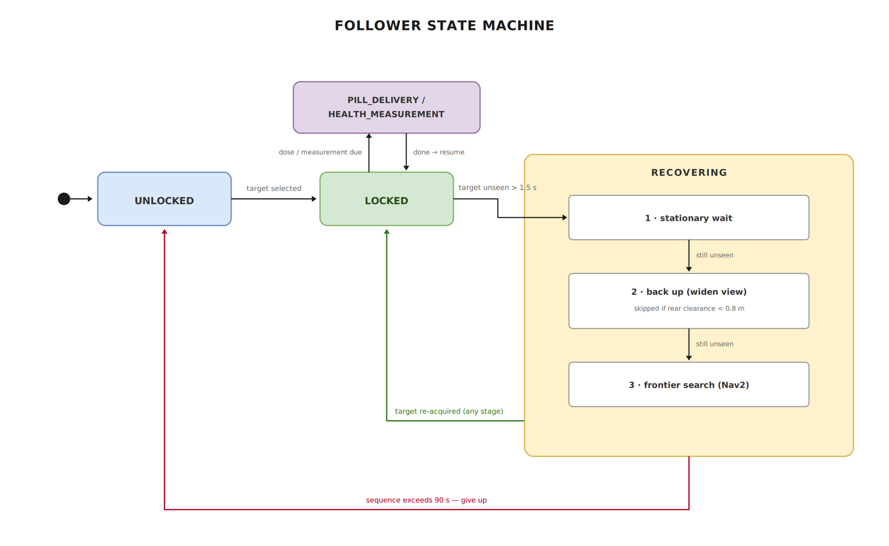

```
UNLOCKED ──(lock)──► LOCKED
LOCKED ──(lost 1.5s)──► RECOVERING_BACKUP    back off, widen the view
       ──(8s)─────────► RECOVERING_FRONTIER  Nav2 to unexplored frontiers
ANY_RECOVERY ──(signature match)──► LOCKED
ANY ──(/pill_time)──► PILL_DELIVERY
```

**Motion control.** Separate PID loops for angular (pixel error) and linear (depth error)
## The safety layer

[`safety_guard_on_rpi.py`](src/person_follower/person_follower/safety_guard_on_rpi.py) is deliberately the dumbest node in the system, and it wins every argument.

```
all other nodes ──► /cmd_vel_raw ──► safety_guard ──► /cmd_vel ──► motors
```

It builds a rectangular polygon from the URDF footprint plus a margin, checks every LaserScan point against it, and vetoes any velocity command heading into an occupied region. The follower publishes *intent*; the guard decides what reaches the wheels. It also colours the polygon green/yellow/red in RViz so you can see it thinking.

Keeping this separate from the follower was a deliberate choice: the follower is complex and could have bugs, so nothing in it is trusted with collision avoidance. It runs on the Pi, so it survives a Wi-Fi dropout that takes the laptop offline.

## Fall detection

[`fall3.py`](src/person_follower/person_follower/fall3.py) runs a **custom-trained** YOLO model (`fall_unified_yolo26m_v1.pt`) that classifies fallen vs upright people, publishing `vision_msgs/Detection2DArray` and an alert on `/Nour_fall_detection`. The weights are attached to this repo's GitHub Release.

## Health monitoring

Falls are the emergency case; the slower signal matters too. A wearable ESP32
carrying a **MAX30102** pulse-oximeter and a **MAX30205** body-temperature sensor
streams heart rate, SpO2 and temperature over Wi-Fi to the orchestration layer,
which posts them alongside the robot's own state.

The point of pairing this with the fall detector is context. A fall alert on its
own tells a carer that someone is on the floor. A fall alert together with a
heart rate and an oxygen reading tells them how urgent it is, and whether the
fall was the cause or the consequence.

*(Firmware and the orchestration service that consumes it were written by other
team members and are not in this repository — see the note above.)*

---

## Repository layout

```
src/person_follower/     person following, fall detection, safety guard
src/wanis_bringup/       our launch files, Nav2/SLAM/EKF configs, URDF, scripts
patches/                 our modifications to the upstream packages
prototype_1/             first prototype: earlier follower, explorer, URDF, launch
robot.repos              upstream dependencies, pinned to exact commits
scripts/                 workspace setup and model download
media/                   photos, diagrams and demo clips
docs/                    build notes and design decisions
```

## Getting it running

```bash
# 1. reconstruct the workspace (clones upstream deps, applies our patches)
./scripts/setup_workspace.sh ~/wanis_ws

# 2. fetch model weights
./scripts/download_models.sh

# 3. build
cd ~/wanis_ws && colcon build --symlink-install && source install/setup.bash
```

Then, on the robot and on the server respectively:

```bash
ros2 launch wanis_bringup hoverboard.launch.py         # Pi: motors, sensors, safety
ros2 launch wanis_bringup hoverboard_server.launch.py  # server: perception, Nav2, SLAM
ros2 run person_follower final_person_follower
```

Requires ROS 2 Jazzy on Ubuntu 24.04 (Python 3.12), plus `ultralytics`, `torch`, `torchreid`, `opencv-python`, `mediapipe`.

> **Note on the full workspace.** This repo contains our own code plus patches, so it stays small and readable. The complete 1.9 GB workspace — every dependency, Gazebo worlds, build artifacts and raw test footage exactly as it ran — is attached as an archive to the [GitHub Release](../../releases).

---

## Two prototypes

| | Prototype 1 | Prototype 2 (final) |
|---|---|---|
| Drive | Small DC motors, Arduino bridge | Hoverboard motors, FOC firmware, `ros2_control` |
| Perception | MediaPipe pose + DeepLabV3 | YOLO26 + BoT-SORT + OSNet ReID |
| Identity | None — followed nearest person | Full four-cue signature lock |
| Recovery | Rotate toward last motion | Three-stage ladder incl. frontier search |
| Compute | Pi + server split | Pi + server split |

| The first prototype | Hardware |
|---|---|
| 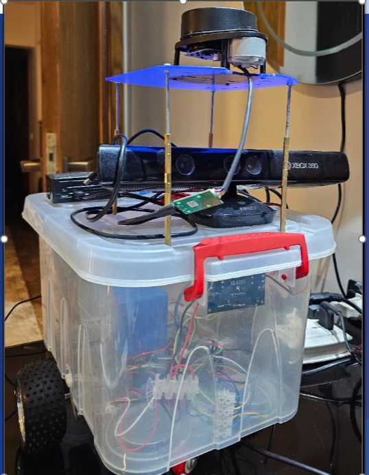 | 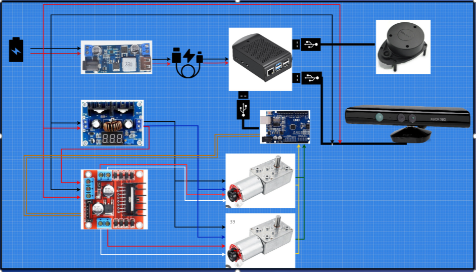 |

| Hardware layout | Software layout |
|---|---|
| 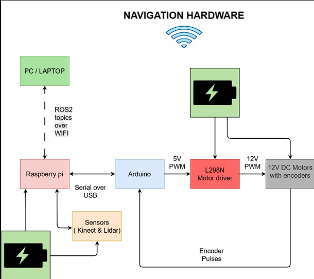 | 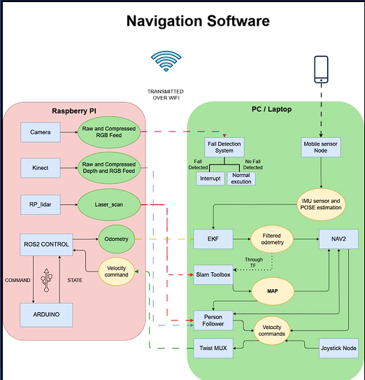 |

Prototype 1 was a small differential-drive base: DC motors through an Arduino
bridge, RPLiDAR, and a depth camera, already split across a Raspberry Pi and a
server. Simple enough to get following working end-to-end quickly, which is
exactly what it was for.

The first prototype is kept in [`prototype_1/`](prototype_1/) because the progression is the interesting part. It established the ideas — PID following, a rear/side proximity guard, frontier exploration when the person is lost — and the second rebuilt them properly once we understood the problem.

The biggest lesson from prototype 1: following the *nearest* person is useless in a real home. The moment a second person walks past, the robot changes its mind. That single failure is why prototype 2 is built entirely around identity.

---

## Team

| Subsystem | Author |
|---|---|
| Robot platform, hoverboard drive, `ros2_control` integration | Yasser Galal |
| Person following, re-identification, recovery state machine | Yasser Galal |
| Safety layer, navigation, SLAM & state estimation | Yasser Galal |
| Fall detection model and node | Nour |
| Assistant, speech pipeline, orchestration, pill dispenser, biometrics | Other team members — *not included in this repository* |

## Built on

This project integrates several open-source packages. They are dependencies, not our work:

| Package | Author | Use |
|---|---|---|
| [hoverboard_ros2_control](https://github.com/DataBot-Labs/hoverboard_ros2_control) | DataBot-Labs | `ros2_control` hardware interface for hoverboard motors |
| [hoverboard-firmware-hack-FOC](https://github.com/hoverboard-robotics/hoverboard-firmware-hack-FOC) | hoverboard-robotics | Open FOC firmware for the motor controller |
| [kinect2_ros2](https://github.com/krepa098/kinect2_ros2) | krepa098 | Kinect v2 driver |
| [KinectV1-Ros2](https://github.com/SriharshaShesham/KinectV1-Ros2) | SriharshaShesham | Kinect v1 driver |
| [bno08x-ros2-driver](https://github.com/bnbhat/bno08x-ros2-driver) | bnbhat | BNO08x IMU driver |
| [ros2-mobile-sensor-bridge](https://github.com/VedantC2307/ros2-mobile-sensor-bridge) | Vedant Choudhary | Streams phone camera/IMU/GPS into ROS 2 over WebSocket — used in prototype 1 to prototype sensing without extra hardware |
| [serial_motor_demo](https://github.com/joshnewans/serial_motor_demo), [ros_arduino_bridge](https://github.com/joshnewans/ros_arduino_bridge) | Josh Newans | Prototype 1 motor control |

Our changes to these are in [`patches/`](patches/) rather than vendored copies, so it stays clear what is ours.

Also uses [Ultralytics YOLO](https://github.com/ultralytics/ultralytics), [torchreid](https://github.com/KaiyangZhou/deep-person-reid) (OSNet), [MediaPipe](https://github.com/google-ai-edge/mediapipe), [Nav2](https://github.com/ros-navigation/navigation2), [slam_toolbox](https://github.com/SteveMacenski/slam_toolbox) and [robot_localization](https://github.com/cra-ros-pkg/robot_localization).

## Licence

MIT — see [LICENSE](LICENSE). Third-party packages remain under their own licences.
